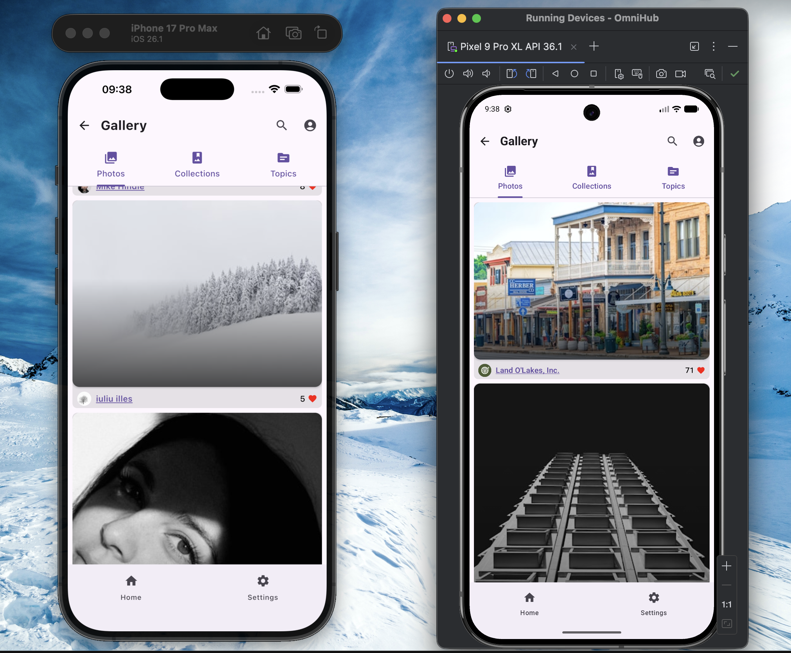
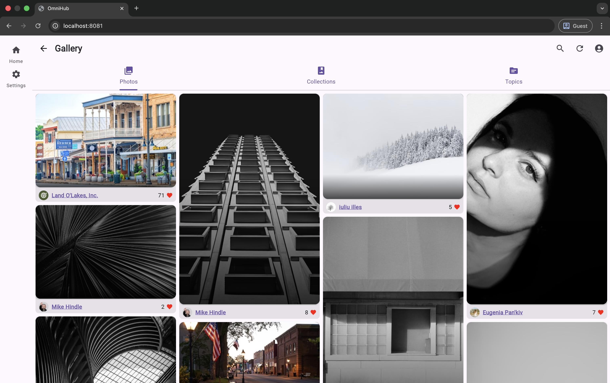
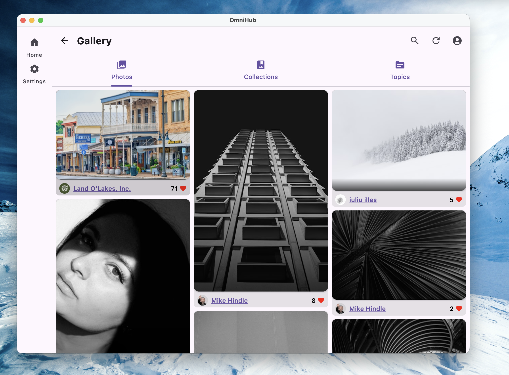

# OmniHub 

[](https://github.com/lackary/omnihub/actions/workflows/ci_mikepenz.yml)
[](https://github.com/lackary/omnihub/releases)
[](https://github.com/lackary/omnihub/blob/main/LICENSE)


> **A Kotlin Multiplatform (KMP) Application featuring MVI Architecture, Modular Design, and Automated CI/CD.**

<table>
  <tr>
    <td text-align="center"><b>Mobile</b></td>
    <td text-align="center"><b>Web</b></td>
    <td text-align="center"><b>Desktop</b></td>
  </tr>
  <tr>
    <td></td>
    <td></td>
    <td></td>
  </tr>
</table>

## Project Overview
OmniHub serves as the **client-side implementation** of a modern multiplatform ecosystem. It is built strictly as a **UI & Presentation Layer** application, consuming core business logic from its companion library, **[OmniFeed](https://github.com/lackary/omnifeed-kmp)**.

This project demonstrates how to decouple UI from logic in a Cross-Platform environment, ensuring that the Android, iOS, Desktop, and Web clients remain thin, reactive, and consistent.

## Technical Architecture
The project adopts a **Modular Clean Architecture** with **MVI (Model-View-Intent)** pattern:

- **Presentation Layer (OmniHub)**:
    - Built with **Compose Multiplatform**.
    - Implements **MVI** pattern: UI observes a single `UiState` and dispatches `Intents` (Events).
    - **Platform Specifics**: Handles platform-unique entry points (Activities, ViewControllers) and Deep Link redirection.
- **Domain & Data Layers (Encapsulated in [OmniFeed Library])**:
    - All business rules, Use Cases, and Repository implementations are strictly isolated in the external `OmniFeed` library.
    - This separation allows the core logic to be versioned, tested, and reused independently of the UI.

### Key Technologies
- **State Management**: Kotlin Flows & Coroutines (StateFlow/SharedFlow).
- **Dependency Injection**: [Koin](https://insert-koin.io) for centralized dependency management across all platforms.
- **Navigation**: Type-safe navigation handling across platforms.
- **CI/CD**: GitHub Actions with [Semantic Release](https://github.com/semantic-release/semantic-release) for automated versioning.

## Key Features & Highlights

### 1. Deep Link Based OAuth 2.0 Flow
Instead of relying on heavy, platform-specific SDKs, OmniHub implements a lightweight **Deep Link Coordination** system for authentication:
- **Universal Redirect Handling**: The app utilizes a shared `DeepLinkBuffer` to capture OAuth callbacks from the system browser.
- **Platform Agnostic**: Whether on Android (Intent Filter), iOS (Universal Links), or Desktop, the authentication flow remains consistent and testable.

### 2. Strict UI/Logic Separation
A key architectural decision was to forbid any direct data manipulation in the UI layer.
- **OmniHub** (this repo) contains **zero** business logic. It only renders State and passes User Intents.
- **OmniFeed** (core lib) handles all API interactions (Unsplash API), token management, and data persistence.

### 3. Automated Release Pipeline
The project adheres to **Conventional Commits** to drive a fully automated release cycle:
- **Semantic Release**: Automatically analyzes commits to determine the next version number (Patch/Minor/Major).
- **Changelog Generation**: Automatically generates release notes based on the commit history.

## Project Structure
- `compose`
    - `commonMain`: Shared UI components, Screens, and ViewModels (MVI).
    - `androidMain` / `iosMain`: Platform entry points and `DeepLink` interception logic.
- `.github/workflows`: CI/CD definitions for automated testing and releasing.
- `gradle/libs.versions.toml`: Centralized dependency management.

---

### Build and Run Android Application

To build and run the development version of the Android app, use the run configuration from the run widget
in your IDE’s toolbar or build it directly from the terminal:
- on macOS/Linux
  ```shell
  ./gradlew :compose:assembleDebug
  ```
- on Windows
  ```shell
  .\gradlew.bat :compose:assembleDebug
  ```

### Build and Run Desktop (JVM) Application

To build and run the development version of the desktop app, use the run configuration from the run widget
in your IDE’s toolbar or run it directly from the terminal:
- on macOS/Linux
  ```shell
  ./gradlew :compose:run
  ```
- on Windows
  ```shell
  .\gradlew.bat :compose:run
  ```

### Build and Run Web Application

To build and run the development version of the web app, use the run configuration from the run widget
in your IDE's toolbar or run it directly from the terminal:
- for the Wasm target (faster, modern browsers):
  - on macOS/Linux
    ```shell
    ./gradlew :compose:wasmJsBrowserDevelopmentRun
    ```
  - on Windows
    ```shell
    .\gradlew.bat :compose:wasmJsBrowserDevelopmentRun
    ```
- for the JS target (slower, supports older browsers):
  - on macOS/Linux
    ```shell
    ./gradlew :compose:jsBrowserDevelopmentRun
    ```
  - on Windows
    ```shell
    .\gradlew.bat :compose:jsBrowserDevelopmentRun
    ```

### Configure CocoaPods Integration

This project uses the Kotlin Multiplatform CocoaPods plugin to handle iOS dependencies.

**Prerequisites:**
1. Install [CocoaPods](https://cocoapods.org/) if you haven't already:

   ```shell
   sudo gem install cocoapods
   ```

   or use `Homebrew` if you have it installed:

   ```shell
   brew install cocoapods
   ```
   
2. In the `gradle/libs.versions.toml` file, add the Kotlin CocoaPods Gradle plugin to the `[plugins]` block:

   ```toml
   kotlinNativeCocoapods = { id = "org.jetbrains.kotlin.native.cocoapods", version.ref = "kotlin" }
   ```
   
3. Navigate to the root `build.gradle.kts` file of your project and add the following alias to the `plugins {}` block:

   ```kotlin
   alias(libs.plugins.kotlinNativeCocoapods) apply false
   ```
4. Open the module where you want to integrate CocoaPods (e.g., the `compose` module), and add the following alias to the `plugins {}` block of the `build.gradle.kts` file:

   ```kotlin
   alias(libs.plugins.kotlinNativeCocoapods)
   ```

**Setup:**
Follow these steps for initial setup or after modifying dependencies:

1. Navigate to the `iosApp` directory:

   ```shell
   cd iosApp
   ```
2. Initialize the pods:

   ```shell
   pod init
   ```
   This generates the `Podfile`.

3. In `compose/build.gradle.kts`, configure the version, summary, homepage, and baseName of the Podspec file in the `cocoapods` block within the `kotlin` block:
   
   ```kotlin
   iosArm64()
   iosSimulatorArm64()
   
   cocoapods {
        // Required properties
        // Specify the required Pod version here
        // Otherwise, the Gradle project version is used
        version = "1.0.0"
        summary = "Some description for a Kotlin/Native module"
        homepage = "Link to a Kotlin/Native module homepage"

        // Optional properties
        // Configure the Pod name here instead of changing the Gradle project name
        name = "Compose"

        framework {
            // Required properties
            // Framework name configuration. Use this property instead of deprecated 'frameworkName'
            baseName = "Compose"

            // Optional properties
            // Specify the framework linking type. It's dynamic by default.
            isStatic = true
            // Dependency export
            // Uncomment and specify another project module if you have one:
            // export(project(":<your other KMP module>"))
            //transitiveExport = false // This is default.
        }

        // Maps custom Xcode configuration to NativeBuildType
        //xcodeConfigurationToNativeBuildType["CUSTOM_DEBUG"] = NativeBuildType.DEBUG
        //xcodeConfigurationToNativeBuildType["CUSTOM_RELEASE"] = NativeBuildType.RELEASE
   }
   ```
   
   Then run **File | Sync Project with Gradle Files** in Android Studio to reimport the project. This process will generate the Podspec file for the project.

4. Update the `Podfile` by adding the following line below `# Pods for iosApp`:

   ```ruby
   pod 'Compose', :path => '../compose'
   ```

5. Run the helper script **setup_ios.sh**. This script automates the following tasks:

   - `./gradlew clean`
   - Create the directory `compose/build/compose/cocoapods/compose-resources`
   - `./gradlew :compose:generateDummyFramework` (generates a dummy framework in `build/cocoapods/framework/Compose.framework`).
   - Move to `iosApp` and run `pod install --repo-update --clean-install`. This generates the `iosApp.xcworkspace` file, which includes the `Compose` module.

6. You will see a notification to **reload project as workspace**. This is **important**; the iOS application build will fail if you do not reload.

### Build and Run iOS Application

To build and run the development version of the iOS app, use the run configuration from the run widget
in your IDE’s toolbar or open the [/iosApp](./iosApp) directory in Xcode and run it from there.

### Local CI Testing

This project uses GitHub Actions for CI/CD. To test the workflows locally without pushing to GitHub, we use [act](https://github.com/nektos/act) along with a helper script.

**Prerequisites:**
1. Install [Docker](https://www.docker.com/).
2. Install `act` (e.g., `brew install act`).
3. Install GitHub CLI `gh` (e.g., `brew install gh`) for authentication.

**How to run:**
We provide a safe wrapper script to handle artifact paths and permissions automatically.

```shell
shell ./run_act_safe.sh
```

This script provides an interactive menu to choose between:
*   **Main Workflow (Mike Penz):** Simulates a `push` event. Fast, single-job routine for daily feedback.
*   **Dorny Workflow (Manual):** Simulates a `workflow_dispatch` event. Multi-job routine for generating detailed standalone reports.

> **Note:** The script will ask for your permission to clean up Gradle build artifacts after execution to save disk space.


---

Learn more about [Kotlin Multiplatform](https://www.jetbrains.com/help/kotlin-multiplatform-dev/get-started.html),
[Compose Multiplatform](https://github.com/JetBrains/compose-multiplatform/#compose-multiplatform),
